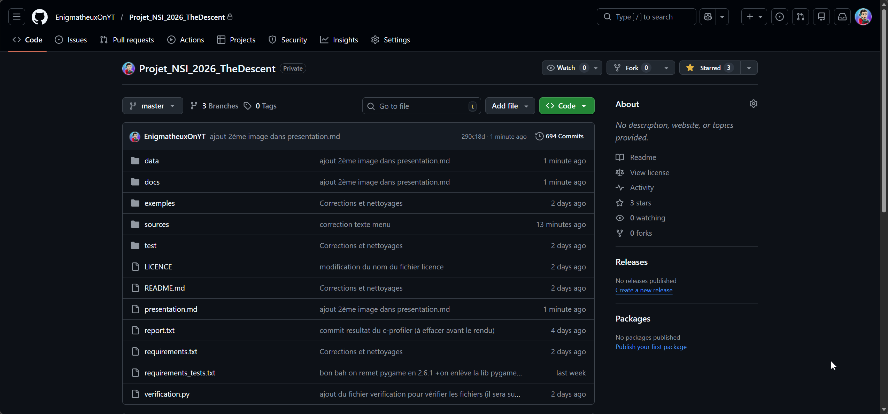
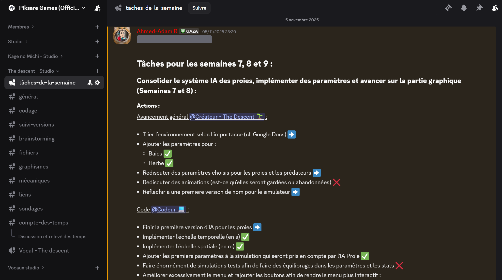
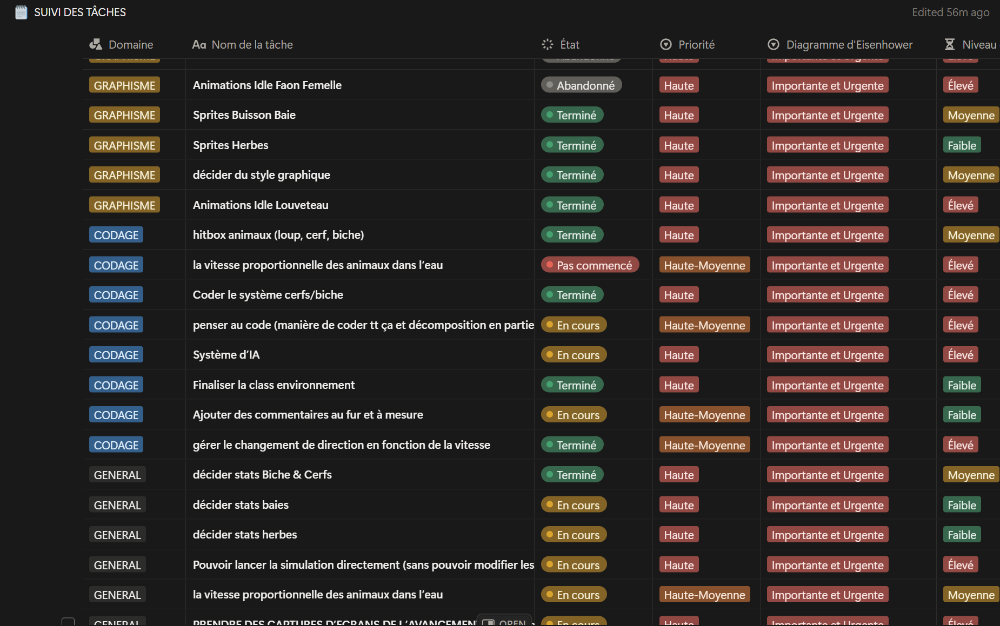
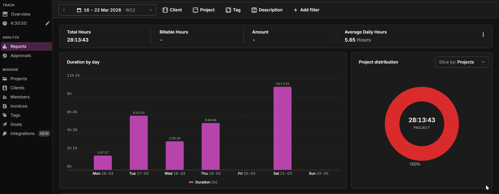
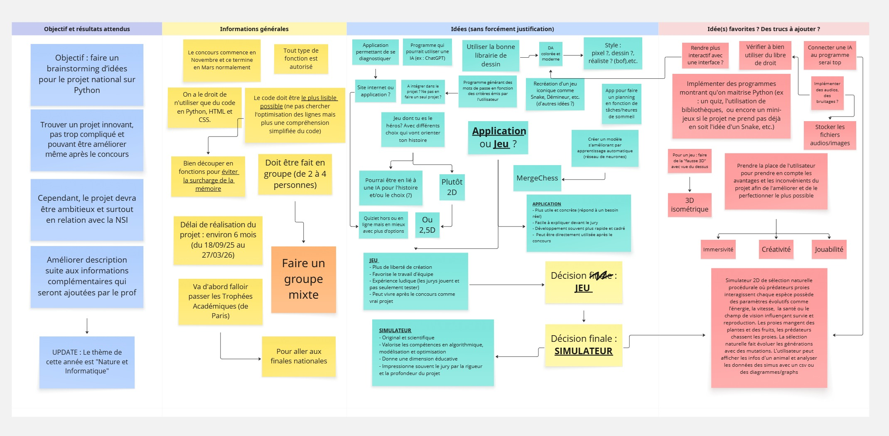
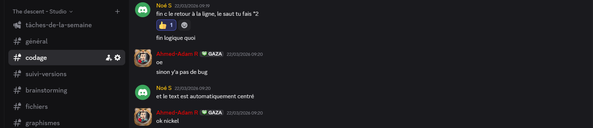
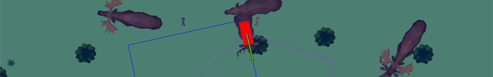

# The Descent — Présentation du projet

> Projet présenté dans le cadre des Trophées NSI 2026.

## 1. Présentation générale

Au départ, notre idée était de créer un jeu vidéo en Python, avec un univers en pixel art et une génération procédurale. Nous avons commencé à réfléchir au gameplay, aux graphismes et à l'histoire, mais nous avons vite compris que ce choix ne permettrait pas de valoriser pleinement ce que nous avions appris en NSI. Un jeu vidéo demande beaucoup de travail artistique et narratif, mais met moins en avant certains aspects essentiels du programme, comme la simulation, l'algorithmique et l'analyse de données.

Nous avons donc fait évoluer notre projet vers un simulateur de sélection naturelle dans un écosystème virtuel. Cette orientation nous a permis de mêler informatique, mathématiques et SVT dans un même outil.

L'idée du simulateur est venue d'Ahmed, à la suite du visionnage d'une vidéo de Code BH sur YouTube présentant une simulation d'évolution. Cette vidéo nous a donné envie de créer notre propre modèle, avec nos espèces, nos paramètres et nos outils d'observation.

**Problématique du projet :**

> **Comment représenter de manière simple et compréhensible l'évolution et l'interaction d'espèces dans un écosystème virtuel, tout en offrant une expérience interactive et paramétrable ?**

Le projet s'appelle **The Descent**. Le titre fait référence au livre de Charles Darwin *The Descent of Man*, mais aussi au mot anglais *descent*, qui renvoie à l'idée de descendance et de transmission. Il résume bien l'objectif du simulateur : observer comment des espèces évoluent au fil des générations, comment certaines s'adaptent, et comment d'autres disparaissent lorsque l'équilibre du milieu est perturbé.

Le simulateur se déroule dans un biome unique, la forêt européenne. Plusieurs espèces y coexistent : herbivores, carnivores et omnivores. Chaque animal possède plusieurs caractéristiques : énergie, vitesse, champ de vision, personnalité, âge, reproduction, etc. Une intelligence artificielle régit leurs comportements, tandis qu'un système de générations et de mutations permet de faire évoluer les espèces au fil du temps.

Une fois la simulation lancée, l'écosystème évolue de manière autonome. L'utilisateur peut observer la scène, suivre un animal en particulier, afficher des informations visuelles comme son champ de vision ou sa trajectoire, consulter les statistiques de la simulation et analyser les résultats grâce à des graphiques et des fichiers CSV. Il est également possible de sauvegarder une simulation pour la rouvrir plus tard ou la partager.

---

## 2. Organisation du travail

Notre équipe est composée de deux élèves de TG1 : **Ahmed-Adam Rezkallah** et **Noé Samuel**. Nous avons travaillé ensemble sur l'ensemble du projet, tout en répartissant certaines parties afin d'avancer plus efficacement en parallèle. **Clément Roux-Bénabou** nous a également apporté une aide ponctuelle sur certaines parties du code et des tests.

Au moment de former les groupes, nous aurions aimé constituer une équipe mixte. Cependant, le nombre très limité de filles dans notre classe réduisait fortement les possibilités de composer un groupe mixte. Nous nous sommes donc adaptés à cette contrainte. Cela ne change pas notre conviction que la NSI doit rester accessible à tous et à toutes, et que la diversité des profils enrichit les projets. Dans cette optique, nous avons aussi fait tester notre simulateur par d'autres élèves afin de recueillir des retours variés.

### Répartition du travail

- **Ahmed-Adam** s'est principalement occupé de la simulation elle-même : environnement, déplacements, IA des animaux, interactions entre espèces, interface utilisateur, graphismes, documentation, vidéos (de présentation et d'avancement) et organisation générale du projet en tant que chef de projet.
- **Noé** s'est davantage occupé du menu principal, du système de boutons, du mode personnalisé, du système de sauvegarde et de chargement, de l'export des données en CSV, ainsi que de l'analyse des simulations et de la création des graphiques avec Matplotlib.

### Outils utilisés pour l'organisation

Nous avons utilisé plusieurs outils pour travailler plus efficacement et suivre l'avancement du projet :

- **GitHub** pour partager le code, gérer les versions et travailler sur un même projet sans perdre de fichiers.
- **Discord** pour communiquer régulièrement, discuter des idées et organiser des séances de travail.
- **Notion** pour noter les fonctionnalités à ajouter, les bugs à corriger et les objectifs de la semaine.
- **Toggl** pour suivre le temps de travail et estimer le volume total investi dans le projet.
- **Miro** au début du projet pour le brainstorming et l'organisation des idées.
 
| GitHub | Discord |
|--------|---------|
|||

| Notion | Toggl |
|--------|-------|
||||

| Miro |
|------|
||
 
La cohésion d'équipe et la communication au sein du groupe ont été très importantes tout au long du projet. Nous échangions régulièrement sur l'avancement de nos parties respectives, sur les problèmes rencontrés et sur les solutions possibles. Nous faisions des points d'avancement afin de décider ensemble des fonctionnalités à ajouter, des améliorations à apporter et des orientations du projet. Nous avons également testé mutuellement certaines parties du programme afin de vérifier leur bon fonctionnement et d'assurer la cohérence de l'ensemble du simulateur.

> \
> *Échange entre nous sur Discord pour vérifier un détail du programme.*

Toutes les décisions importantes concernant le projet, comme les fonctionnalités à développer, l'organisation du code ou l'ajout de nouvelles espèces, ont été prises ensemble et de manière concertée. Nous avons toujours discuté des options possibles, évalué les avantages et les inconvénients, et choisi la solution la plus cohérente pour le projet dans son ensemble. Cela nous a permis de garder une direction commune tout en respectant les compétences et le rythme de chacun.

Cette manière de travailler nous a permis d'avancer de façon coordonnée, d'éviter de nombreux problèmes d'incompatibilité entre nos différentes parties et de maintenir une progression régulière tout au long de l'année, y compris en dehors des heures de NSI consacrées au projet. Le temps de travail estimé à l'aide de Toggl s'élève à environ **[280 heures pour Ahmed-Adam](exemples/temps_de_travail_Ahmed-Adam.png)** et **[253 heures pour Noé](exemples/temps_de_travail_Noe.png)**. Le projet étant ambitieux, cela a demandé un investissement important et constant.

### Usage de l'IA

Nous avons également utilisé des outils d'intelligence artificielle comme aide technique, mais de manière limitée, réfléchie et strictement pédagogique. Ils nous ont servi à gagner du temps sur certains points techniques que nous ne maîtrisions pas encore totalement, comme le fonctionnement de bibliothèques, certaines interactions avec le système d'exploitation ou la gestion de fichiers externes.

L'IA ne nous a pas servi à concevoir l'architecture du projet, les algorithmes principaux ni les fonctionnalités essentielles du simulateur. Elle a été un outil d'assistance, pas un substitut au travail de conception.

Un document intitulé *[nature_du_code.txt](docs/nature_du_code.txt)*, présent dans le dossier **[docs](docs)**, précise plus en détail l'origine du projet, l'usage de l'IA et les sources externes utilisées.

Le dossier **[docs](docs)** contient également plusieurs éléments utiles pour comprendre le projet :

- une [liste des bibliothèques utilisées](docs/librairies_utilisees.txt) ;
- un [document sur les codes de sortie et les erreurs du programme](docs/codes_de_sortie.txt) ;
- un [document récapitulant les tâches semaine par semaine](docs/Taches_par_semaine.pdf) ;
- les [différentes features du simulateur](docs/features.txt).

L'ensemble de ces documents permet de suivre l'organisation, le fonctionnement et l'évolution du projet sur l'année.

---

## 3. Étapes de réalisation

Le projet s'est construit en plusieurs étapes successives.

Nous avons d'abord mené une phase de brainstorming afin de trouver une idée cohérente et réalisable. Nous avons ensuite défini plus précisément le fonctionnement du simulateur, les espèces présentes, les caractéristiques des animaux et les grandes règles de la simulation.

La deuxième grande étape a été la création de l'environnement : carte, déplacements, zoom et dézoom, collisions et affichage. Nous avons ensuite développé l'intelligence artificielle des animaux, c'est-à-dire leurs comportements : chercher de la nourriture, fuir un prédateur, se reproduire ou former des groupes.

Nous avons ensuite travaillé sur le menu principal et l'interface utilisateur, avec notamment l'ajout du chargement de simulation et du mode personnalisé. En parallèle, nous avons développé le tableau de bord de simulation, qui permet d'afficher les statistiques et d'analyser la simulation.

Une autre étape importante a été l'intégration de l'export en CSV et de la génération de graphiques et diagrammes avec Matplotlib. Enfin, nous avons consacré beaucoup de temps aux tests, à la correction des bugs, à l'équilibrage des espèces et à l'amélioration des performances.

---

## 4. Validation de l'opérationnalité

Au moment du dépôt, le simulateur est fonctionnel et permet de lancer des simulations complètes avec plusieurs espèces animales.

On y trouve notamment :

- des **herbivores** comme les cerfs, les lapins ou les élans ;
- des **carnivores** comme les loups et les renards ;
- des **omnivores** comme les ours ou les sangliers.

Chaque animal possède plusieurs caractéristiques : énergie, âge, vitesse, champ de vision, régime alimentaire, reproduction, personnalité, ainsi qu'un système de générations et de mutations qui permet de faire évoluer les espèces au fil du temps.

Le simulateur propose également plusieurs fonctionnalités d'observation et d'analyse. Via le tableau de bord, il est possible de :

- suivre un animal en particulier et afficher ses informations visuelles, comme son champ de vision, sa trajectoire, sa hitbox ou son vecteur vitesse ;
- ouvrir le profil détaillé de l'animal suivi ;
- modifier certaines touches, par exemple pour mettre la simulation en pause, ouvrir le tableau de bord ou passer en plein écran ;
- consulter le nombre d'animaux en vie, le nombre d'animaux morts, le temps de simulation ou encore l'espèce dominante.

Il est également possible d'arrêter la simulation pour l'analyser, afficher des graphiques et diagrammes, télécharger les graphiques et exporter les données en fichier CSV.

Nous avons réalisé de nombreux tests pour vérifier le bon fonctionnement du projet : déplacements, interactions entre espèces, reproduction, générations, sauvegardes, exports CSV, graphiques et performances lorsque beaucoup d'animaux sont présents.

Nous avons rencontré plusieurs difficultés, notamment pour équilibrer les espèces, gérer les nombreuses interactions entre animaux, optimiser les performances et mettre en place le système de sauvegarde et d'analyse. Ces problèmes ont été résolus progressivement grâce aux tests et à de nombreux ajustements.

---

## 5. Ouverture et bilan

Après les Trophées NSI, nous souhaitons continuer à développer le projet en ajoutant progressivement de nouvelles fonctionnalités. Nous aimerions notamment intégrer plusieurs biomes, des mutations rares comme des individus albinos, des maladies, un système de météo, ainsi que davantage de comportements pour les animaux.

Nous souhaitons aussi améliorer l'interface utilisateur, les outils d'analyse et les performances afin de simuler davantage d'individus et de générations plus rapidement. Nous prévoyons également de retravailler certaines parties du code pour améliorer son organisation et sa lisibilité, car l'ampleur du projet nous a parfois amenés à privilégier l'ajout de fonctionnalités plutôt que la structuration complète du programme.

Si c'était à refaire, nous commencerions probablement par une version plus simple, avec moins d'espèces, afin de mieux équilibrer la simulation dès le début. Nous documenterions aussi certaines parties plus tôt pour éviter de concentrer une grande partie de la rédaction à la fin du projet.

Ce projet nous a permis de développer de nombreuses compétences : programmation Python, algorithmique, simulation, analyse de données avec graphiques, gestion de projet et travail d'équipe. Nous avons également appris beaucoup de choses sur les écosystèmes et le fonctionnement des espèces dans la nature.

Par exemple, nous avons étudié les chaînes alimentaires, les relations prédateur-proie, la compétition entre espèces pour les ressources, ainsi que l'impact que peut avoir la disparition d'une espèce sur tout un écosystème. Nous avons aussi compris que l'évolution d'une espèce ne dépend pas seulement de sa force ou de sa vitesse, mais d'un ensemble de paramètres : reproduction, consommation d'énergie, capacité à fuir ou à se cacher, coopération entre individus, etc.

Nous avons également abordé de manière concrète des notions scientifiques comme la sélection naturelle, les mutations génétiques, l'adaptation au milieu, l'équilibre d'un écosystème ou encore la dynamique des populations. Le fait de programmer une simulation nous a obligés à comprendre ces concepts pour pouvoir les modéliser informatiquement.

Enfin, nous avons essayé de rendre notre projet compréhensible et accessible, même pour des personnes qui ne connaissent pas la programmation. L'objectif n'est pas seulement de proposer une simulation informatique, mais aussi un outil à intérêt pédagogique. Le simulateur peut servir à comprendre visuellement la sélection naturelle, les chaînes alimentaires, l'équilibre d'un écosystème ou l'évolution d'une population au fil des générations.

Les fichiers sont organisés de manière à permettre une évolution progressive du projet : il est possible de créer une espèce ou une nourriture en ajoutant simplement un fichier JSON contenant ses informations. Des modèles sont disponibles dans le dossier **[templates](data/templates)**.

Nous avons donc cherché à construire un projet à la fois informatique, scientifique et accessible, pouvant intéresser aussi bien des élèves et des enseignants que des personnes curieuses du fonctionnement d'un écosystème et de l'importance de son équilibre.